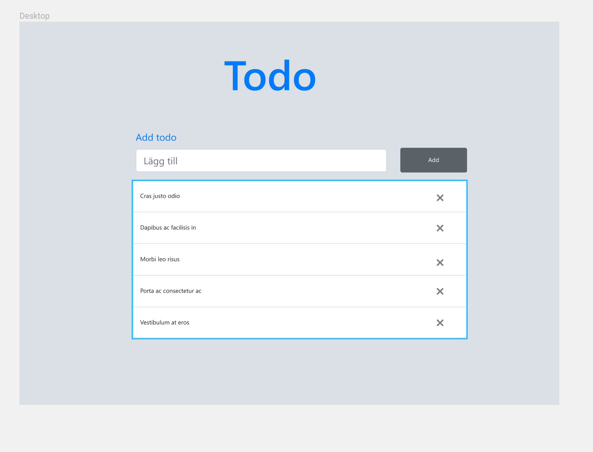

# Todoapp
1. The project should have a material design look to it
2. The user should be able to create and delete and task
3. Using Apollo-GraphQL on the client is mandatory.

 


## Setup

1. Open your terminal.

2. Locate your new-todoapp cd into the directory Frontend.

3. Inside the Frontend run the dev server:
```
npm start
```

4. Go to:
```
http://localhost:3000
```


# Development
 Frontend of this project is mostly made of CRA - Create React App and Apollo GraphQL the backend of this project of was produced by graphql boilerplate provided by `graphql-cli` 

## Deployment

The Backend of this project is deployed at Zeit Now and the Frontend is deployed at netlify

* [Frontend](https://5bed79df3813f0466aae502b--todoproject.netlify.com/) 
* [Backend](https://my-app-nkefnbuovn.now.sh). 

## Testing

Testing Graphql queries is mostly done with using Enzyme and jest to together to run test in the Frontend application run

```
npm test
```

Testing the graphql mutation was harder so I used cypress for because it's easier to simlute event handling and integration test in. 
In order to run cypress run type the following command

```
npm run cypress
```
